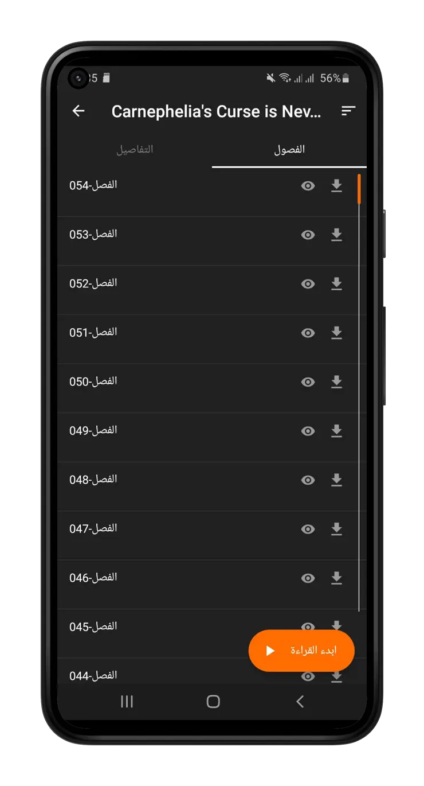

# Manga Slayer - Android Manga Reader

**Manga Slayer** is an Arabic manga reader application designed for Android devices. It allows users to read and watch Arabic-translated manga for free, with no annoying ads and a smooth reading experience. 

This project provides a simple landing page for downloading the Manga Slayer app for Android.

## Features

- **Massive Library**: Thousands of Arabic-translated manga titles for all tastes.
- **No Ads**: Enjoy reading without any interruptions.
- **User-friendly Interface**: Simple and intuitive design to make browsing fun and easy.
- **Regular Updates**: New chapters added regularly.

## Installation

You can download the Manga Slayer APK file for Android from the official release page:

- [Download Manga Slayer APK](https://github.com/abdlhay/Manga_slayer/releases)

## How to Use

1. Download the APK file from the link above.
2. Allow installation from unknown sources in your device settings.
3. Install the APK on your Android device.
4. Enjoy reading your favorite manga in Arabic.

## Technologies Used

- **HTML5**
- **CSS3**
- **JavaScript**
- **Font Awesome** for icons
- **Google Fonts** for custom typography

## Screenshots

## Contributing

Feel free to fork this repository, and submit pull requests.

## License

This project is licensed under the MIT License - see the [LICENSE](LICENSE) file for details.

## Acknowledgments

- **Manga Slayer Team** for the app development.
- **GitHub** for hosting the code repository.

## NOTE

THIS WEBSITE IS AN UNOFFICIAL LANDING PAGE FOR DOWNLOADING THE MANGA SLAYER APP.
THE APP IS NOT OWNED OR DEVELOPED BY THE OUTHOR OF THIS WEBSITE.

## Contact

For further inquiries, you can reach out to the Manga Slayer Team or follow the repository's updates via GitHub.

- **GitHub**: [https://github.com/abdlhay/Manga_slayer](https://github.com/abdlhay/Manga_slayer)

---

With 💙 by Karrar©